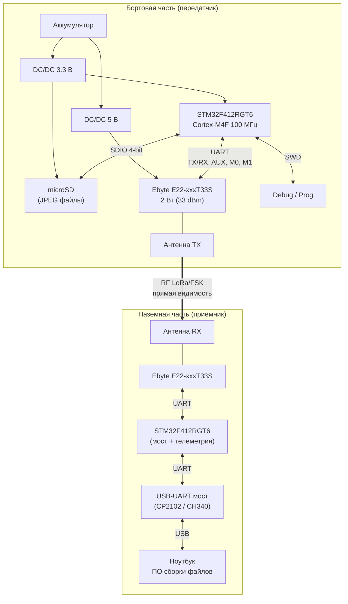

# ТЗ: LorettLink — система передачи изображений

| | |
|---|---|
| **Проект**  | LorettLink |
| **Документ** | Техническое задание на систему передачи изображений со стратосферного зонда |
| **Ревизия**  | 0.2 |
| **Дата**     | 2026-02-26 |

---

## 1. Назначение

Бортовой передатчик для стратосферного зонда. Считывает заранее записанные изображения (JPEG) с microSD-карты и передаёт их по радиоканалу LoRa/FSK на наземную приёмную станцию с использованием помехоустойчивого кодирования Reed-Solomon (erasure-FEC). Наземная станция восстанавливает файлы из принятых блоков и отображает результат в графическом интерфейсе.

Ключевые свойства протокола:

- **Однонаправленная передача** — борт только передаёт, обратный канал не требуется.
- **Erasure-FEC** — потеря до M блоков на RS-группу восстанавливается без повторной передачи.
- **Файл восстанавливается 1:1** при получении любых K из N блоков.

---

## 2. Состав системы

### 2.1 Структурная схема



### 2.2 Перечень составных частей

| # | Узел | Назначение |
|---|------|------------|
| 1 | Плата передатчика (борт) | MCU + microSD + радиомодуль + питание + RS-кодирование |
| 2 | Плата приёмника (земля) | MCU + радиомодуль + USB-UART мост + формирование TELEM |
| 3 | ПО наземной станции — приёмник | Приём FEC/TELEM пакетов, RS-декодирование, сборка файлов, GUI |
| 4 | ПО наземной станции — передатчик-симулятор | Тестовая утилита: кодирование и отправка по TCP |

### 2.3 Структура репозитория

```
LorettLink/
├── LorettLink_tx/             # Прошивка бортового передатчика (PlatformIO, STM32Cube)
│   ├── src/                   # main.c, e22_driver.c, fec_packet.c, gf256.c, rs_encode.c, sd_fatfs.c
│   └── include/               # config.h, e22_driver.h, fec_packet.h, gf256.h, rs_encode.h, sd_fatfs.h
├── LorettLink_rx/             # Прошивка наземного приёмника (PlatformIO, STM32Cube)
│   ├── src/                   # main.c, e22_driver.c, telem.c
│   └── include/               # config.h, e22_driver.h, telem.h
├── receiver/                  # ПО наземной станции — приёмник (Python/PyQt5)
│   ├── lorettlink_receiver.py # Главное приложение
│   ├── erasure_fec.py         # RS кодек (ErasureEncoder / ErasureDecoder)
│   ├── protocol.py            # StreamParser (FEC + TELEM)
│   ├── widgets.py             # ChunkMatrixWidget
│   ├── theme_manager.py       # Управление темами
│   ├── mainwindow.ui          # Qt Designer UI
│   └── styles/                # dark.qss, light.qss
├── transmitter/               # ПО наземной станции — передатчик-симулятор (Python/PyQt5)
│   ├── lorettlink_transmitter.py
│   ├── erasure_fec.py, protocol.py, widgets.py, theme_manager.py
│   ├── transmitter.ui
│   └── styles/
├── test_images/               # Тестовые JPEG-изображения
└── requirements.txt           # PyQt5, pyserial, reedsolo
```

---

## 3. Требования к бортовому передатчику

### 3.1 Микроконтроллер

| Параметр | Требование |
|----------|------------|
| Модель | **STM32F412RGT6** (LQFP-64) |
| Ядро | ARM Cortex-M4F, 180 МГц |
| Flash / SRAM | 512 КБ / 128 КБ |
| Интерфейс к microSD | SDIO 4-bit (PC8–PC11 D0–D3, PC12 CK, PD2 CMD) |
| Интерфейс к радиомодулю | USART1 (PA9 TX, PA10 RX), 9600 бод |
| Управление E22 | PB0 AUX (вход), PB1 M0, PB2 M1 (выходы) |
| Отладочный UART | USART2 (PA2 TX, PA3 RX), 115200 бод |
| Отладка | SWD (4-pin: SWDIO, SWCLK, GND, 3.3 В) |
| Индикация | LED на PA5 |
| Питание | 3.3 В ±5% |

Тактирование: HSI 16 МГц → PLL → 180 МГц SYSCLK, APB1 45 МГц, APB2 90 МГц, SDIO 45 МГц.

### 3.2 Хранение данных

| Параметр | Требование |
|----------|------------|
| Носитель | microSD (SDHC), подключение по SDIO 4-bit |
| Файловая система | FAT32 (FatFs) |
| Формат изображений | JPEG |
| Целевой размер файла | до 64 КБ (FILE_BUF_MAX = 65536) |
| Структура карты | Корневая папка с файлами `*.JPG` |

Алгоритм работы: циклический обход всех JPEG-файлов на карте, чтение в RAM-буфер, кодирование и передача, пауза 5 с между циклами.

### 3.3 Радиомодуль

| Параметр | Требование |
|----------|------------|
| Серия | **Ebyte E22-xxxT33S** |
| Мощность передатчика | 2 Вт (33 dBm) |
| Интерфейс | UART (TTL 3.3 В), 9600 бод |
| Управляющие линии | TX, RX, AUX, M0, M1 |
| Питание модуля | 5 В (отдельный DC/DC) |
| Режим работы | P2P, transparent mode, полудуплекс |
| Sub-packet size | 240 байт |
| Air rate по умолчанию | 9.6 кбит/с (E22_AIRRATE_9K6) |
| Канал по умолчанию | 0x17 (23) |

Варианты модулей по диапазонам:

| Модуль | Диапазон | Примечание |
|--------|----------|------------|
| E22-170T33S | 150–173 МГц | Требует правовой проработки |
| E22-400T33S | 410–493 МГц | Покрывает любительский диапазон 430–440 МГц |
| E22-900T33S | 850–930 МГц | ISM 868/915 МГц |

> Модули **не являются pin-to-pin совместимыми**. Плата проектируется под один конкретный модуль.

### 3.4 Питание

| Параметр | Требование |
|----------|------------|
| Входное напряжение | от аккумулятора (1S LiPo 3.0–4.2 В или 2S 6.0–8.4 В — уточнить) |
| DC/DC 3.3 В | для MCU, microSD, логика; ток ≥ 500 мА |
| DC/DC 5 В | для радиомодуля; ток ≥ 1.5 А (пиковый при TX 2 Вт) |
| Развязка | раздельные DC/DC для цифровой части и RF |
| Фильтрация | керамические конденсаторы рядом с VCC радиомодуля (100 нФ + 10 мкФ + 100 мкФ) |
| Защита | от переполюсовки и просадки напряжения при TX |

---

## 4. Требования к наземному приёмнику (прошивка)

### 4.1 Аппаратная часть

| Параметр | Требование |
|----------|------------|
| MCU | STM32F412RGT6 (аналогичен передатчику) |
| Радиомодуль | Ebyte E22-xxxT33S (тот же диапазон, что и борт) |
| USART1 | К радиомодулю E22 (9600 бод), приём по прерыванию (ring buffer 1024 Б) |
| USART2 | К USB-UART мосту (115200 бод), передача на ноутбук |
| Антенна | направленная (Yagi / коллинеарная) |
| Питание | от USB ноутбука (5 В) |

### 4.2 Алгоритм работы прошивки приёмника

1. Инициализация: тактирование 180 МГц, GPIO, UART, E22 в режиме RX (RSSI byte ON).
2. Приём по прерыванию USART1 в кольцевой буфер.
3. В главном цикле: сканирование буфера на sync-паттерн `0x55 0x68`.
4. При обнаружении FEC-пакета (256 байт):
   - Чтение пакета + 1 байт RSSI из буфера.
   - Пересылка 256-байтного FEC-пакета на PC через USART2.
   - Формирование и отправка 10-байтного TELEM-пакета с RSSI.
5. Heartbeat LED каждые 2 с.

---

## 5. Протокол передачи данных

### 5.1 Общие принципы

- Файл разбивается на **K блоков данных** фиксированного размера.
- RS-кодер генерирует **M parity-блоков**, распределённых по RS-группам.
- Каждый блок передаётся как самодостаточный **FEC-пакет** размером 256 байт.
- Передача **однонаправленная** (broadcast) — обратный канал не требуется.
- При получении **любых K из N** (N = K + M) блоков файл восстанавливается 1:1.
- CRC-32 на каждый пакет для обнаружения битовых ошибок.

### 5.2 Параметры кодирования

| Параметр | Значение |
|----------|----------|
| Размер пакета | **256 байт** (фиксированный) |
| Payload блока | **200 байт** |
| Заголовок | **20 байт** |
| CRC-32 | **4 байта** (CRC bytes [1..219]) |
| Reserved | **32 байта** (нули) |
| Поле Галуа | GF(2^8), примитивный полином 0x11D |
| Макс. RS-кодовое слово | 255 символов |
| FEC overhead по умолчанию | 25% (настраиваемый, 5–100%) |
| Межпакетная пауза (борт) | 50 мс |

### 5.3 RS-группы (interleaved encoding)

Ограничение GF(2^8): одно RS-кодовое слово не более 255 символов. Для файлов, где K + M > 255, данные разбиваются на **RS-группы**:

- Блок `i` принадлежит группе `i % num_groups`.
- Каждая группа кодируется независимо: `g_size` data + `m_per_group` parity ≤ 255.
- Кодирование **поколоночное**: для каждого из 200 байт payload формируется отдельное RS-кодовое слово.
- Потеря до `m_per_group` блоков **в каждой группе** восстанавливается.

Вычисление параметров групп:

```
m_desired = ceil(K × fec_ratio)
if K + m_desired ≤ 255:
    1 группа, g_size = K, m_g = m_desired
else:
    m_g = round(fec_ratio × 255 / (1 + fec_ratio)), max 127
    g_size = 255 - m_g
    num_groups = ceil(K / g_size)
N = K + num_groups × m_g
```

### 5.4 FEC-пакет (256 байт)

| Смещение | Размер | Поле | Описание |
|----------|--------|------|----------|
| 0 | 1 | `sync` | `0x55` |
| 1 | 1 | `type` | `0x68` |
| 2–5 | 4 | `callsign` | Base-40, big-endian (6 символов → 32 бит) |
| 6 | 1 | `image_id` | ID изображения (0–255) |
| 7–8 | 2 | `block_id` | Индекс блока (big-endian, 0..N−1) |
| 9–10 | 2 | `k_data` | Количество data-блоков K |
| 11–12 | 2 | `n_total` | Общее количество блоков N = K + M |
| 13–16 | 4 | `file_size` | Размер файла в байтах |
| 17 | 1 | `file_type` | `0x00` = raw, `0x01` = JPEG, `0x02` = WebP |
| 18 | 1 | `m_per_group` | Parity-блоков на RS-группу |
| 19 | 1 | `num_groups` | Количество RS-групп |
| 20–219 | 200 | `payload` | Данные блока (data или parity) |
| 220–223 | 4 | `crc32` | CRC-32 байт [1..219] |
| 224–255 | 32 | `reserved` | Нули |

Блоки с `block_id < k_data` — data, с `block_id ≥ k_data` — parity.

### 5.5 Кодирование позывного (Base-40)

Алфавит: `0123456789ABCDEFGHIJKLMNOPQRSTUVWXYZ-_. ` (40 символов).

Позывной до 6 символов кодируется в 32-битное целое:

```
value = 0
for ch in callsign:
    value = value × 40 + index(ch)
```

### 5.6 TELEM-пакет (10 байт)

Формируется приёмником (MCU) и передаётся на ноутбук вместе с FEC-пакетами.

| Смещение | Размер | Поле | Описание |
|----------|--------|------|----------|
| 0–1 | 2 | `sync` | `0xA55A` (little-endian: `0x5A, 0xA5`) |
| 2 | 1 | `version` | `0x01` |
| 3 | 1 | `type` | `0x30` |
| 4–5 | 2 | `rssi` | int16, little-endian, дБм |
| 6 | 1 | `snr` | int8, дБ × 4 |
| 7 | 1 | `tx_power` | uint8, дБм |
| 8–9 | 2 | `crc16` | CRC-16 CCITT (init 0xFFFF, poly 0x1021) байт [2..7] |

### 5.7 Алгоритм передачи (борт)

```
БОРТ (STM32 + E22)                          ЭФИР
  │                                            │
  ├──── FEC block 0 (data)  ──────────────────►│
  ├──── FEC block 1 (data)  ──────────────────►│
  ├──── ...                                    │
  ├──── FEC block K-1 (data)  ────────────────►│
  ├──── FEC block K (parity, group 0)  ───────►│
  ├──── FEC block K+1 (parity, group 0)  ─────►│
  ├──── ...                                    │
  ├──── FEC block N-1 (parity, last group) ───►│
  │                                            │
  │    (пауза 1 с, переход к следующему файлу) │
```

1. Чтение JPEG-файла с microSD в RAM-буфер.
2. Вычисление параметров RS-групп (K, M, g_size, m_g, num_groups).
3. Последовательная передача K data-блоков через E22 (пауза 50 мс между пакетами).
4. Поколоночное RS-кодирование для каждой группы, передача parity-блоков.
5. Пауза 1 с, переход к следующему файлу.
6. После обхода всех файлов — пауза 5 с, повтор цикла.

### 5.8 Алгоритм приёма (наземная станция)

```
НАЗЕМНАЯ СТАНЦИЯ (ноутбук)
  │
  ├── StreamParser: разбор потока байт
  │     ├── sync 0x55 + type 0x68 → FEC-пакет (256 Б)
  │     └── sync 0x5A 0xA5       → TELEM-пакет (10 Б)
  │
  ├── ErasureDecoder: накопление блоков
  │     ├── Новый image_id → сброс декодера
  │     ├── Учёт data и parity блоков
  │     └── При получении ≥ K блоков → RS-декодирование
  │
  └── Результат: восстановленный JPEG 1:1
```

---

## 6. Требования к ПО наземной станции

### 6.1 Приёмник (`receiver/`)

| Параметр | Требование |
|----------|------------|
| Язык | Python 3 |
| GUI | PyQt5 (Qt Widgets, Fusion style) |
| Вход | COM-порт (pyserial) / TCP-сервер / локальная симуляция |
| Парсинг | StreamParser: FEC (0x55 0x68, 256 Б) + TELEM (0x5A 0xA5, 10 Б) |
| Декодирование | ErasureDecoder (reedsolo): RS-декодирование по группам |
| Выход | Восстановленные JPEG/WebP файлы |
| Отображение | Предпросмотр изображения, матрица блоков (ChunkMatrixWidget), прогресс-бар, лог, RSSI/SNR/TX Power |
| Темы | Светлая / Тёмная (QSS), сохранение через QSettings |

Функции:

- Подключение к COM-порту (выбор порта, baud rate).
- TCP-сервер для приёма от передатчика-симулятора.
- Локальная симуляция (выбор файла, задержка, FEC overhead).
- Автоматический предпросмотр (обновление каждые 500 мс).
- Сохранение восстановленного файла.
- Вкладка «Настройки»: тема, параметры симуляции.

### 6.2 Передатчик-симулятор (`transmitter/`)

| Параметр | Требование |
|----------|------------|
| Язык | Python 3 |
| GUI | PyQt5 (Qt Widgets, Fusion style) |
| Выход | TCP-клиент (подключение к приёмнику) |
| Кодирование | ErasureEncoder (reedsolo): RS-кодирование по группам |
| Функции | Выбор файла, предпросмотр, настройка callsign / FEC overhead / задержки |
| Телеметрия | Генерация TELEM-пакетов с симулированным RSSI/SNR каждые 64 блока |
| Отображение | Матрица блоков, прогресс-бар, лог |
| Темы | Светлая / Тёмная (QSS), сохранение через QSettings |

### 6.3 Зависимости

```
PyQt5>=5.15
pyserial>=3.5
reedsolo>=1.7
```

---

## 7. Требования к PCB передатчика

### 7.1 Питание

- Раздельные DC/DC для цифровой части (3.3 В) и радиомодуля (5 В).
- Керамические конденсаторы рядом с VCC радиомодуля: 100 нФ, 10 мкФ, 100 мкФ.
- Сплошной полигон GND; правильная разводка токов возврата RF.

### 7.2 Антенный тракт

- Линия 50 Ом от радиомодуля до антенного разъёма.
- Минимальная длина тракта.
- Согласующая цепь (Pi/T) под рабочий диапазон.

### 7.3 Разводка PCB

| Параметр | Требование |
|----------|------------|
| Слои | ≥ 2 (рекомендовано 4: TOP, GND, PWR, BOTTOM) |
| Антенный тракт | 50 Ом, минимальная длина |
| Антенный разъём | SMA или U.FL (уточнить) |
| Земля | сплошной полигон GND, звёздная точка объединения силовой и цифровой земли |

### 7.4 Интерфейсы на плате

| Разъём / пады | Назначение |
|---------------|------------|
| SWD (4-pin) | Прошивка и отладка MCU |
| UART debug (2-pin) | Отладочный вывод логов (USART2) |
| microSD слот | Push-push или push-pull |
| Антенна (SMA / U.FL) | Подключение внешней антенны |
| Питание (2-pin) | Вход от аккумулятора |

### 7.5 Тест-пойнты

Вывести на плату: VCC 3.3 В, VCC 5 В, GND, UART TX/RX (E22), AUX.

---

## 8. Оценка производительности

### 8.1 Время передачи одного файла

Размер пакета 256 байт, полезная нагрузка 200 байт, FEC overhead 25%.

| Размер JPEG | K блоков | N блоков (25% FEC) | Air rate 9.6 кбит/с | Air rate 62.5 кбит/с |
|-------------|----------|--------------------|---------------------|---------------------|
| 10 КБ | 51 | 64 | ~14 с | ~2.1 с |
| 30 КБ | 154 | 193 | ~41 с | ~6.3 с |
| 50 КБ | 256 | 320 | ~68 с | ~10.5 с |
| 64 КБ | 328 | 410 | ~87 с | ~13.4 с |

> С учётом межпакетной паузы 50 мс. Фактическое время = N × (256 Б / air_rate + 50 мс).

### 8.2 Дальность

При 33 dBm (2 Вт), прямая видимость со стратосферы (20–35 км высота):

- **LoRa SF12/BW125** (2.4 кбит/с): чувствительность ~−148 дБм, запас линк-бюджета достаточен.
- **LoRa SF7/BW500** (62.5 кбит/с): чувствительность ~−123 дБм, на пределе при большом расстоянии.
- Рекомендуемый режим: **SF9–SF10, BW 125–250 кГц** (~4.7–9.6 кбит/с).

---

## 9. Сборка и запуск

### 9.1 Прошивки (PlatformIO)

```bash
# Передатчик
cd LorettLink_tx
pio run -t upload

# Приёмник
cd LorettLink_rx
pio run -t upload
```

Требования: PlatformIO, ST-Link, плата STM32F412RG.

### 9.2 ПО наземной станции

```bash
pip install -r requirements.txt

# Приёмник
cd receiver
python lorettlink_receiver.py

# Передатчик-симулятор
cd transmitter
python lorettlink_transmitter.py
```

---

## 10. Частотные ограничения (РФ)

| Диапазон | Частоты | Статус |
|----------|---------|--------|
| 2 м | 144–146 МГц | Любительский, требует позывной |
| 70 см | 430–440 МГц | Любительский, требует позывной |
| ~170 МГц | 150–173 МГц | Не любительский, требует отдельного разрешения |
| 868/915 МГц | ISM | Ограничения по мощности и скважности |

> Перед эксплуатацией необходимо проверить актуальные нормативные требования.

---

## 11. Открытые вопросы

| # | Вопрос | Варианты |
|---|--------|----------|
| 1 | Рабочий диапазон | 430–440 МГц (рекомендуется) / 868 МГц / 170 МГц |
| 2 | Конкретная модель модуля Ebyte | E22-400T33S / E22-900T33S / E22-170T33S |
| 3 | Входное напряжение / тип аккумулятора | 1S LiPo / 2S LiPo / внешнее 5–12 В |
| 4 | Антенный разъём | SMA / U.FL / впаянная антенна |
| 5 | Размеры платы | Ограничения конструктива зонда |
| 6 | Air rate | SF9 BW125 (~4.7 кбит/с) / SF10 BW125 (~2.4 кбит/с) / SF7 BW500 (~62.5 кбит/с) |
| 7 | Максимальный размер JPEG | 64 КБ (текущий) / увеличить буфер |
| 8 | FEC overhead | 25% (текущий) / адаптивный по условиям канала |
