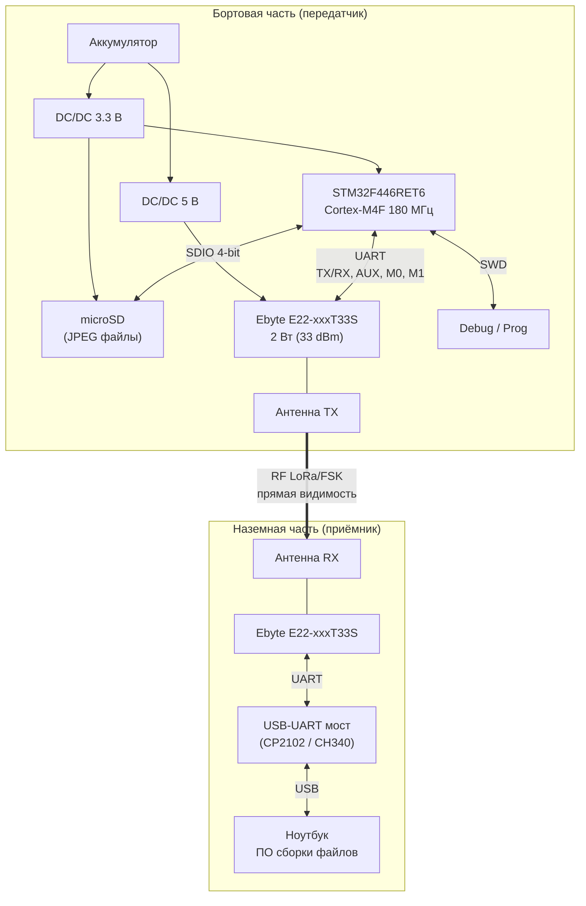

# ТЗ: LORett StratoLink — плата передатчика изображений

| | |
|---|---|
| **Проект**  | LORett StratoLink |
| **Документ** | Техническое задание на плату бортового передатчика |
| **Ревизия**  | 0.1 (драфт) |
| **Дата**     | 2026-02-26 |

---

## 1. Назначение

Бортовой передатчик для стратосферного зонда. Считывает заранее записанные изображения (JPEG) с microSD-карты и передаёт их по радиоканалу LoRa/FSK на наземную приёмную станцию. Наземная станция собирает файлы из пакетов и сохраняет на ноутбук.

---

## 2. Состав системы

### 2.1 Структурная схема



### 2.2 Перечень составных частей

| # | Узел | Назначение |
|---|------|------------|
| 1 | Плата передатчика (борт) | MCU + microSD + радиомодуль + питание |
| 2 | Плата приёмника (земля) | Радиомодуль + USB-UART мост |
| 3 | ПО наземной станции | Приём пакетов, сборка файлов, управление повторами |

---

## 3. Требования к бортовому передатчику

### 3.1 Микроконтроллер

| Параметр | Требование |
|----------|------------|
| Модель | **STM32F446RET6** (LQFP-64) |
| Ядро | ARM Cortex-M4F, 180 МГц |
| Flash / SRAM | 512 КБ / 128 КБ |
| Интерфейс к microSD | SDIO 4-bit |
| Интерфейс к радиомодулю | UART (TTL 3.3 В) |
| Отладка | SWD (4-pin: SWDIO, SWCLK, GND, 3.3 В) |
| Аппаратный CRC | CRC-32, используется для контрольных сумм пакетов и файлов |
| Питание | 3.3 В ±5% |

Дополнительно использовать:

- **DMA** для чтения microSD и передачи по UART — разгрузка CPU.
- **Аппаратный CRC** — вычисление CRC пакетов и файлов без нагрузки на ядро.
- Отдельные UART для: (1) радиомодуля, (2) отладочного вывода, (3) резерв под телеметрию.

### 3.2 Хранение данных

| Параметр | Требование |
|----------|------------|
| Носитель | microSD (SDHC), подключение по SDIO 4-bit |
| Файловая система | FAT32 |
| Формат изображений | JPEG |
| Целевой размер файла | 50–200 КБ |
| Структура карты | Корневая папка с файлами `IMG_0001.jpg` … `IMG_NNNN.jpg` |
| Манифест (опционально) | `manifest.txt` — список файлов с CRC32 для проверки целостности |

### 3.3 Радиомодуль

| Параметр | Требование |
|----------|------------|
| Серия | **Ebyte E22-xxxT33S** |
| Мощность передатчика | 2 Вт (33 dBm) |
| Интерфейс | UART (TTL 3.3 В) |
| Управляющие линии | TX, RX, AUX, M0, M1 |
| Питание модуля | 5 В (отдельный DC/DC) |
| Режим работы | P2P (point-to-point), полудуплекс |

Варианты модулей по диапазонам:

| Модуль | Диапазон | Примечание |
|--------|----------|------------|
| E22-170T33S | 150–173 МГц | Требует правовой проработки (не любительский) |
| E22-400T33S | 410–493 МГц | Покрывает любительский диапазон 430–440 МГц |
| E22-900T33S | 850–930 МГц | ISM 868/915 МГц |

> Модули **не являются pin-to-pin совместимыми**. Плата проектируется под один конкретный модуль. При необходимости поддержки нескольких диапазонов — отдельные ревизии платы или сменный мезонин.

### 3.4 Питание

| Параметр | Требование |
|----------|------------|
| Входное напряжение | от аккумулятора (1S LiPo 3.0–4.2 В или 2S 6.0–8.4 В — уточнить) |
| DC/DC 3.3 В | для MCU, microSD, логика; ток ≥ 500 мА |
| DC/DC 5 В | для радиомодуля; ток ≥ 1.5 А (пиковый при TX 2 Вт) |
| Развязка | раздельные DC/DC для цифровой части и RF |
| Фильтрация | керамические конденсаторы рядом с VCC радиомодуля (100 нФ + 10 мкФ + 100 мкФ) |
| Защита | от переполюсовки и просадки напряжения при TX |

### 3.5 Разводка PCB

| Параметр | Требование |
|----------|------------|
| Слои | ≥ 2 (рекомендовано 4: TOP, GND, PWR, BOTTOM) |
| Антенный тракт | 50 Ом, минимальная длина, согласование под рабочий диапазон |
| Антенный разъём | SMA или U.FL (уточнить) |
| Земля | сплошной полигон GND, звёздная точка объединения силовой и цифровой земли |
| Тест-пойнты | UART TX/RX (отладка), SWD, VCC 3.3 В, VCC 5 В, GND |
| Размеры | уточняются по конструктиву зонда |

---

## 4. Требования к наземному приёмнику

| Параметр | Требование |
|----------|------------|
| Радиомодуль | Ebyte E22-xxxT33S (тот же диапазон, что и борт) |
| Мост к ноутбуку | USB-UART (CP2102 / CH340 / FTDI) или MCU с USB-CDC |
| Антенна | направленная (Yagi / коллинеарная) — для увеличения дальности |
| Питание | от USB ноутбука (5 В) |

---

## 5. Протокол передачи данных

### 5.1 Общие принципы

- Файл передаётся как последовательность **чанков фиксированного размера**.
- Размер payload чанка: **128–240 байт** (настраивается, ограничен subpackage модуля Ebyte).
- CRC на каждый пакет + CRC32 на весь файл.
- Подтверждение приёма по окнам (ACK bitmap).
- Полудуплекс: борт передаёт → земля подтверждает → борт досылает.

### 5.2 Типы сообщений

#### META — описание файла

Отправляется бортом перед началом передачи файла. Повторяется до получения ACK.

| Поле | Тип | Описание |
|------|-----|----------|
| `sync` | u16 | Маркер синхронизации: `0xA55A` |
| `ver` | u8 | Версия протокола |
| `type` | u8 | `0x01` = META |
| `image_id` | u32 | Уникальный ID файла |
| `file_size` | u32 | Размер файла, байт |
| `chunk_size` | u16 | Размер payload чанка, байт |
| `total_chunks` | u32 | Общее количество чанков |
| `file_crc32` | u32 | CRC32 всего файла |
| `crc16` | u16 | CRC16 пакета |

#### DATA — чанк данных

| Поле | Тип | Описание |
|------|-----|----------|
| `sync` | u16 | `0xA55A` |
| `ver` | u8 | Версия протокола |
| `type` | u8 | `0x02` = DATA |
| `image_id` | u32 | ID файла |
| `chunk_idx` | u32 | Индекс чанка (от 0) |
| `payload_len` | u16 | Длина данных в этом чанке (≤ chunk_size) |
| `payload` | u8[N] | Данные |
| `crc16` | u16 | CRC16 пакета (заголовок + payload) |

#### ACK — подтверждение окна

Отправляется землёй после приёма окна чанков.

| Поле | Тип | Описание |
|------|-----|----------|
| `sync` | u16 | `0xA55A` |
| `ver` | u8 | Версия протокола |
| `type` | u8 | `0x10` = ACK |
| `image_id` | u32 | ID файла |
| `window_start` | u32 | Индекс первого чанка в окне |
| `bitmap` | u8[8] | 64 бит: 1 = чанк получен, 0 = требуется повтор |
| `crc16` | u16 | CRC16 пакета |

#### DONE — завершение передачи файла

| Поле | Тип | Описание |
|------|-----|----------|
| `sync` | u16 | `0xA55A` |
| `ver` | u8 | Версия протокола |
| `type` | u8 | `0x20` = DONE |
| `image_id` | u32 | ID файла |
| `status` | u8 | `0x00` = успех, `0x01` = ошибка CRC |
| `crc16` | u16 | CRC16 пакета |

### 5.3 Алгоритм обмена

```
БОРТ                                    ЗЕМЛЯ
  │                                       │
  ├──── META ────────────────────────────►│
  │◄──── ACK (META получен) ─────────────┤
  │                                       │
  ├──── DATA chunk 0 ───────────────────►│
  ├──── DATA chunk 1 ───────────────────►│
  ├──── ...                               │
  ├──── DATA chunk 63 ──────────────────►│
  │                                       │
  │◄──── ACK bitmap (окно 0..63) ────────┤
  │                                       │
  ├──── DATA chunk 5  (повтор) ─────────►│
  ├──── DATA chunk 22 (повтор) ─────────►│
  │                                       │
  │◄──── ACK bitmap (все получены) ──────┤
  │                                       │
  ├──── DATA chunk 64 ──────────────────►│
  ├──── ...  (следующее окно)             │
  │                                       │
  ├──── DONE ───────────────────────────►│
  │◄──── ACK (DONE) ─────────────────────┤
```

1. Борт отправляет **META** и ждёт ACK (повтор каждые 2 с, до 10 попыток).
2. Борт отправляет окно из **64 чанков** DATA.
3. Земля отвечает **ACK bitmap** — борт досылает пропущенные чанки.
4. Цикл повторяется до завершения файла.
5. Борт отправляет **DONE**, земля проверяет CRC32 всего файла.
6. Переход к следующему файлу.

### 5.4 Таймауты и повторы

| Параметр | Значение |
|----------|----------|
| Таймаут ожидания ACK | 2 с |
| Макс. повторов META | 10 |
| Макс. повторов окна | 5 |
| Пауза между чанками | ≥ 20 мс (время переключения TX→RX модуля) |
| Размер окна | 64 чанка |

---

## 6. Оценка производительности

### 6.1 Время передачи одного файла

Air rate модулей Ebyte E22: **2.4–62.5 кбит/с** (зависит от конфигурации SF/BW).

| Размер JPEG | Air rate 62.5 кбит/с | Air rate 9.6 кбит/с | Air rate 2.4 кбит/с |
|-------------|---------------------|---------------------|---------------------|
| 50 КБ | ~7 с | ~42 с | ~2.8 мин |
| 100 КБ | ~13 с | ~84 с | ~5.6 мин |
| 200 КБ | ~26 с | ~2.8 мин | ~11 мин |

> К указанным значениям добавить **+30–50%** на заголовки, ACK, повторы и паузы переключения.

### 6.2 Дальность

При 33 dBm (2 Вт), прямая видимость со стратосферы (20–35 км высота):

- **LoRa SF12/BW125** (2.4 кбит/с): чувствительность приёмника ~−148 дБм, запас линк-бюджета достаточен.
- **LoRa SF7/BW500** (62.5 кбит/с): чувствительность ~−123 дБм, на пределе при большом расстоянии.
- Рекомендуемый режим для баланса скорость/дальность: **SF9–SF10, BW 125–250 кГц** (~4.7–9.6 кбит/с).

---

## 7. Требования к PCB передатчика

### 7.1 Питание

- Раздельные DC/DC для цифровой части (3.3 В) и радиомодуля (5 В).
- Керамические конденсаторы рядом с VCC радиомодуля: 100 нФ, 10 мкФ, 100 мкФ.
- Сплошной полигон GND; правильная разводка токов возврата RF.

### 7.2 Антенный тракт

- Линия 50 Ом от радиомодуля до антенного разъёма.
- Минимальная длина тракта.
- Согласующая цепь (Pi/T) под рабочий диапазон.

### 7.3 Интерфейсы на плате

| Разъём / пады | Назначение |
|---------------|------------|
| SWD (4-pin) | Прошивка и отладка MCU |
| UART debug (2-pin) | Отладочный вывод логов |
| microSD слот | Push-push или push-pull, стандартный |
| Антенна (SMA / U.FL) | Подключение внешней антенны |
| Питание (2-pin) | Вход от аккумулятора |

### 7.4 Тест-пойнты

Вывести на плату: VCC 3.3 В, VCC 5 В, GND, UART TX/RX (радиомодуль), AUX.

---

## 8. Требования к ПО наземной станции

| Параметр | Требование |
|----------|------------|
| Язык | Python 3 (рекомендуется) |
| Вход | COM-порт (USB-UART) |
| Функции | приём пакетов, проверка CRC16, сборка файла по chunk_idx, отправка ACK bitmap, проверка CRC32 файла |
| Выход | восстановленные JPEG-файлы в указанную папку |
| Логирование | запись всех принятых пакетов с временными метками |
| Отображение | прогресс-бар передачи, статистика потерь |

---

## 9. Частотные ограничения (РФ)

Для радиолюбительского применения:

| Диапазон | Частоты | Статус |
|----------|---------|--------|
| 2 м | 144–146 МГц | Любительский, требует позывной |
| 70 см | 430–440 МГц | Любительский, требует позывной |
| ~170 МГц | 150–173 МГц | Не любительский, требует отдельного разрешения |
| 868/915 МГц | ISM | Ограничения по мощности и скважности |

> Перед эксплуатацией необходимо проверить актуальные нормативные требования.

---

## 10. Открытые вопросы

Для перехода к разработке схемы и PCB необходимо зафиксировать:

| # | Вопрос | Варианты |
|---|--------|----------|
| 1 | Рабочий диапазон | 430–440 МГц (рекомендуется) / 868 МГц / 170 МГц |
| 2 | Конкретная модель модуля Ebyte | E22-400T33S / E22-900T33S / E22-170T33S |
| 3 | Входное напряжение / тип аккумулятора | 1S LiPo / 2S LiPo / внешнее 5–12 В |
| 4 | Антенный разъём | SMA / U.FL / впаянная антенна |
| 5 | Размеры платы | Ограничения конструктива зонда |
| 6 | Air rate (компромисс скорость/дальность) | SF9 BW125 (~4.7 кбит/с) / SF7 BW500 (~62.5 кбит/с) |
| 7 | Размер payload чанка | 128 / 200 / 240 байт |
